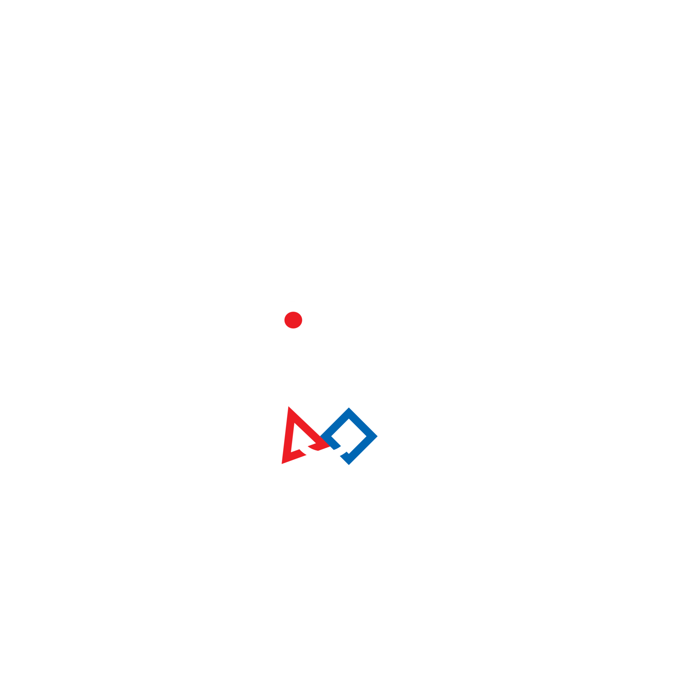

# 🔧 Welcome to 3512's GitHub! ⚙️

3512 Spartatroniks is based in Orcutt, California, and is a First Robotics Competition (FRC)  We are a high school competitive robotics team participating in [FIRST](https://www.firstinspires.org) which aims to teach students about possibilities in STEM Careers, as well as the FIRST core values

Our team was created in 2010, and has been a 501(c)3 non-profit since 2018. Our mission is to inspire high school students about the benifits of working in STEM are, as well as building our community while staying as connected as possible with outreach events and hosting FLL tournaments.

<picture>
    
</picture>
